Homework 7 Answer Key
================
Melinda K. Higgins, PhD.
April 6, 2017

------------------------------------------------------------------------

Homework 7 - Assignment
-----------------------

Recall the NHANES dataset that we used in Lesson 10.

1.  In the dataset there is a discrete variable called SleepTrouble indicating whether each participant has trouble sleeping or not. You are going to build a set of classifiers for this dependent variable. You may use any (set of) independent variable(s) you like except for the variable callsed SleepHrsNight. For each of the model types (null model, logistic regression, decision tree, random forest, k-nearest neighbor) do the following:

    1A. Build the classifier.

    1B. Report its effectiveness on the NHANES dataset.

    1C. Make an appropriate visualization of this model.

    1D. Interpret the results. What have you learned about people's sleeping habits?

2.  Repeat problem 1 except now you are to use the quantitative variable called SleepHrsNight. The model types are as follows: null model, multiple regression, regression tree, random forest.

------------------------------------------------------------------------

Homework 7 - Answer Key
-----------------------

Given the instructions providing in the assignment (above), it is useful to review the code and examples provided in "lesson 10" in Dr. Hertzberg's Github repository at <https://github.com/vhertzb/Lesson10>. Specifically, review the steps in the `Lesson10.Rmd` R markdown file. This "part 1" covered the code and steps for predicting `Diabetes` from these variables: `Age`, `Gender`, `BMI`, `HHIncome`, and `PhysActive`. The code and examples shown include:

-   the "null" model (i.e. the proportion of people with diabetes versus not)
-   running KNN (k-Nearest Neighbor Classification) (via `knn` from the `class` package)
-   a decision tree (via `rpart()` from the `rpart` package)
-   and using `randomForest` from the `randomForest` package

**NOTE**: Lesson 10's `Lesson10.Rmd` R markdown did not include the code for running a logistic regression for Diabetes, but this was covered earlier around week 5; see <https://github.com/melindahiggins2000/N741linearlogmodels> when we covered generalized linear models. We also did more with logistic regression in week 6, see <https://github.com/melindahiggins2000/N741predict>.

### Load the NHANES dataset and review the variables included

``` r
# load the NHANES package with the NHANES dataset
library(NHANES)
```

    ## Warning: package 'NHANES' was built under R version 3.3.3

``` r
# create a data object for the NHANES dataset
dat1 <- NHANES

# list all of the variables included
names(dat1)
```

    ##  [1] "ID"               "SurveyYr"         "Gender"          
    ##  [4] "Age"              "AgeDecade"        "AgeMonths"       
    ##  [7] "Race1"            "Race3"            "Education"       
    ## [10] "MaritalStatus"    "HHIncome"         "HHIncomeMid"     
    ## [13] "Poverty"          "HomeRooms"        "HomeOwn"         
    ## [16] "Work"             "Weight"           "Length"          
    ## [19] "HeadCirc"         "Height"           "BMI"             
    ## [22] "BMICatUnder20yrs" "BMI_WHO"          "Pulse"           
    ## [25] "BPSysAve"         "BPDiaAve"         "BPSys1"          
    ## [28] "BPDia1"           "BPSys2"           "BPDia2"          
    ## [31] "BPSys3"           "BPDia3"           "Testosterone"    
    ## [34] "DirectChol"       "TotChol"          "UrineVol1"       
    ## [37] "UrineFlow1"       "UrineVol2"        "UrineFlow2"      
    ## [40] "Diabetes"         "DiabetesAge"      "HealthGen"       
    ## [43] "DaysPhysHlthBad"  "DaysMentHlthBad"  "LittleInterest"  
    ## [46] "Depressed"        "nPregnancies"     "nBabies"         
    ## [49] "Age1stBaby"       "SleepHrsNight"    "SleepTrouble"    
    ## [52] "PhysActive"       "PhysActiveDays"   "TVHrsDay"        
    ## [55] "CompHrsDay"       "TVHrsDayChild"    "CompHrsDayChild" 
    ## [58] "Alcohol12PlusYr"  "AlcoholDay"       "AlcoholYear"     
    ## [61] "SmokeNow"         "Smoke100"         "Smoke100n"       
    ## [64] "SmokeAge"         "Marijuana"        "AgeFirstMarij"   
    ## [67] "RegularMarij"     "AgeRegMarij"      "HardDrugs"       
    ## [70] "SexEver"          "SexAge"           "SexNumPartnLife" 
    ## [73] "SexNumPartYear"   "SameSex"          "SexOrientation"  
    ## [76] "PregnantNow"

``` r
# other packages needed
library(dplyr)
```

    ## 
    ## Attaching package: 'dplyr'

    ## The following objects are masked from 'package:stats':
    ## 
    ##     filter, lag

    ## The following objects are masked from 'package:base':
    ## 
    ##     intersect, setdiff, setequal, union

``` r
library(ggplot2)
```

    ## Warning: package 'ggplot2' was built under R version 3.3.3

### Investigate the 2 Outcomes of Interest `SleepTrouble` and `SleepHrsNight`

``` r
class(dat1$SleepTrouble)
```

    ## [1] "factor"

``` r
summary(dat1$SleepTrouble)
```

    ##   No  Yes NA's 
    ## 5799 1973 2228

``` r
class(dat1$SleepHrsNight)
```

    ## [1] "integer"

``` r
summary(dat1$SleepHrsNight)
```

    ##    Min. 1st Qu.  Median    Mean 3rd Qu.    Max.    NA's 
    ##   2.000   6.000   7.000   6.928   8.000  12.000    2245

So, `SleepTrouble` is a "Factor" with 2 levels "No" and "Yes" with some missing data "NA"s.

But `SleepHrsNight` is a numeric variable (specifically an integer) with values ranging from 2 to 12 hours per night.

### Visualize `SleepTrouble` Outcome of Interest

NOTE: `ggplot()` codes based on examples at "Cookbook for R" website for the "R Graphics Cookbook" book at <http://www.cookbook-r.com/Graphs/>.

``` r
# Bar chart of Frequency/Counts for Skeep Trouble with NAs
dat1 %>%
  ggplot(aes(x=SleepTrouble, fill=SleepTrouble)) +
    geom_bar(stat="count", colour="black") +
    ggtitle("Frequency of Subjects with Sleep Trouble")
```

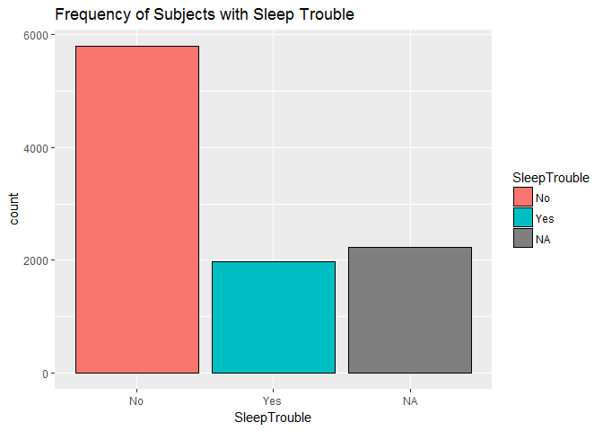

### You'll notice the following for `SleepTrouble`:

1.  It is a factor with 2 levels with values of "No and "Yes", which we can see by running `head(dat1$SleepTrouble)`. It is important to note this since some "classifier" procedures and functions in R assume that the "target" variable is coded 0 or 1.

``` r
head(dat1$SleepTrouble)
```

    ## [1] Yes  Yes  Yes  <NA> Yes  <NA>
    ## Levels: No Yes

1.  The majority of the subjects do NOT have Sleep Trouble - most are "No"s
2.  There are also a decent number of NAs which will be removed in the final analyses - or at least ignored. It will be important to know how the chosen classifier function or procedure handles missing NA data.

### Visualize `SleepHrsNight` Outcome of Interest

``` r
# Histogram overlaid with kernel density curve
dat1 %>% 
  ggplot(aes(x=SleepHrsNight)) + 
    geom_histogram(aes(y=..density..), 
                   binwidth=1,
                   colour="black", fill="yellow") +
    geom_density(alpha=.2, fill="blue", adjust=2) +
    ggtitle("Histogram Density Plot of Sleep Hours Per Night")
```

    ## Warning: Removed 2245 rows containing non-finite values (stat_bin).

    ## Warning: Removed 2245 rows containing non-finite values (stat_density).

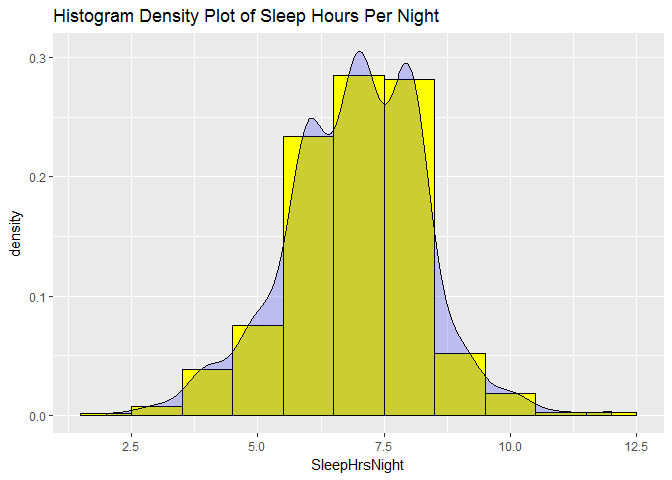

### You'll notice the following for `SleepHrsNight`:

1.  There were still quite a few missing values as seen when we ran the `summary(dat1$SleepHrsNight)` above. It will be important to know how the chosen classifier function or procedure handles missing NA data.
2.  Since this is a numeric outcome, the classifiers chosen will be performing "regression" based models as opposed to "category probability" type models like logistic regression.
3.  That said, the distribution of `SleepHrsNight` is reasonably symmetric and approximately normally distributed which is good with no obvious outliers, even though the range of sleep times is wide from 2 to 12 hours, which is interesting.

Overall Notes on **Open-Ended Approach** for This Homework 7 Assignment
-----------------------------------------------------------------------

While the NHANES dataset had 76 variables, it was intended for you to choose a subset you thought would be appropriate for predicting/classifying those with trouble sleeping and/or their time spent sleeping.

A side note on sleep times - given that the hours spent sleeping was numeric and ordinal in nature and was symmetrically and approximately normally distributed, it was OK to approach modeling `SleepHrsNight` as a continuous/numeric outcome (i.e. a "regression-type" approach). However, it was also OK if you decided to recode this variable into subjects with low sleep times (say &lt; 7) versus more sleep. You could have also looked at recoding `SleephrsNight` into those with optimal sleep (7-9 hrs) versus less than optimal (which includes both those people with less than 7 hrs and more than 9 hrs - both too little and too much sleep can be problematic). Any of these approaches were OK.

PART 1 - Build "classifiers" for `SleepTrouble`
-----------------------------------------------

For each of the model types (null model, logistic regression, decision tree, random forest, k-nearest neighbor):

-   1A. Build the classifier.
-   1B. Report its effectiveness on the NHANES dataset.
-   1C. Make an appropriate visualization of this model.
-   1D. Interpret the results. What have you learned about people's sleeping habits?

### Pick a subset of likely variables for predicting Sleep Trouble

For my approach, I'm choosing the following 10 variables as possible predictors of sleep problems:

1.  age
2.  gender
3.  marital status
4.  poverty
5.  home ownership
6.  BMI
7.  Diabetes
8.  health in general
9.  depressed
10. physically active

``` r
# build dataset for these 10 variables and SleepTrouble
people <- NHANES %>% 
  select(Age, Gender, MaritalStatus, Poverty, HomeOwn,
         BMI, Diabetes, HealthGen, Depressed, PhysActive,
         SleepTrouble) 

# run summary
summary(people)
```

    ##       Age           Gender          MaritalStatus     Poverty     
    ##  Min.   : 0.00   female:5020   Divorced    : 707   Min.   :0.000  
    ##  1st Qu.:17.00   male  :4980   LivePartner : 560   1st Qu.:1.240  
    ##  Median :36.00                 Married     :3945   Median :2.700  
    ##  Mean   :36.74                 NeverMarried:1380   Mean   :2.802  
    ##  3rd Qu.:54.00                 Separated   : 183   3rd Qu.:4.710  
    ##  Max.   :80.00                 Widowed     : 456   Max.   :5.000  
    ##                                NA's        :2769   NA's   :726    
    ##   HomeOwn          BMI        Diabetes        HealthGen      Depressed   
    ##  Own  :6425   Min.   :12.88   No  :9098   Excellent: 878   None   :5246  
    ##  Rent :3287   1st Qu.:21.58   Yes : 760   Vgood    :2508   Several:1009  
    ##  Other: 225   Median :25.98   NA's: 142   Good     :2956   Most   : 418  
    ##  NA's :  63   Mean   :26.66               Fair     :1010   NA's   :3327  
    ##               3rd Qu.:30.89               Poor     : 187                 
    ##               Max.   :81.25               NA's     :2461                 
    ##               NA's   :366                                                
    ##  PhysActive  SleepTrouble
    ##  No  :3677   No  :5799   
    ##  Yes :4649   Yes :1973   
    ##  NA's:1674   NA's:2228   
    ##                          
    ##                          
    ##                          
    ## 

``` r
# Convert back to dataframe
people <- as.data.frame(people)
glimpse(people)
```

    ## Observations: 10,000
    ## Variables: 11
    ## $ Age           <int> 34, 34, 34, 4, 49, 9, 8, 45, 45, 45, 66, 58, 54,...
    ## $ Gender        <fctr> male, male, male, male, female, male, male, fem...
    ## $ MaritalStatus <fctr> Married, Married, Married, NA, LivePartner, NA,...
    ## $ Poverty       <dbl> 1.36, 1.36, 1.36, 1.07, 1.91, 1.84, 2.33, 5.00, ...
    ## $ HomeOwn       <fctr> Own, Own, Own, Own, Rent, Rent, Own, Own, Own, ...
    ## $ BMI           <dbl> 32.22, 32.22, 32.22, 15.30, 30.57, 16.82, 20.64,...
    ## $ Diabetes      <fctr> No, No, No, No, No, No, No, No, No, No, No, No,...
    ## $ HealthGen     <fctr> Good, Good, Good, NA, Good, NA, NA, Vgood, Vgoo...
    ## $ Depressed     <fctr> Several, Several, Several, NA, Several, NA, NA,...
    ## $ PhysActive    <fctr> No, No, No, NA, No, NA, NA, Yes, Yes, Yes, Yes,...
    ## $ SleepTrouble  <fctr> Yes, Yes, Yes, NA, Yes, NA, NA, No, No, No, No,...

``` r
# Convert factors to numeric - the packages just seem to work better that way
people$Gender <- as.numeric(people$Gender)
people$MaritalStatus <- as.numeric(people$MaritalStatus)
people$HomeOwn <- as.numeric(people$HomeOwn)
people$Diabetes <- as.numeric(people$Diabetes)
people$HealthGen <- as.numeric(people$HealthGen)
people$Depressed <- as.numeric(people$Depressed)
people$PhysActive <- as.numeric(people$PhysActive)
people$SleepTrouble <- as.numeric(people$SleepTrouble)

summary(people)
```

    ##       Age            Gender      MaritalStatus      Poverty     
    ##  Min.   : 0.00   Min.   :1.000   Min.   :1.000   Min.   :0.000  
    ##  1st Qu.:17.00   1st Qu.:1.000   1st Qu.:3.000   1st Qu.:1.240  
    ##  Median :36.00   Median :1.000   Median :3.000   Median :2.700  
    ##  Mean   :36.74   Mean   :1.498   Mean   :3.158   Mean   :2.802  
    ##  3rd Qu.:54.00   3rd Qu.:2.000   3rd Qu.:4.000   3rd Qu.:4.710  
    ##  Max.   :80.00   Max.   :2.000   Max.   :6.000   Max.   :5.000  
    ##                                  NA's   :2769    NA's   :726    
    ##     HomeOwn           BMI           Diabetes       HealthGen    
    ##  Min.   :1.000   Min.   :12.88   Min.   :1.000   Min.   :1.000  
    ##  1st Qu.:1.000   1st Qu.:21.58   1st Qu.:1.000   1st Qu.:2.000  
    ##  Median :1.000   Median :25.98   Median :1.000   Median :3.000  
    ##  Mean   :1.376   Mean   :26.66   Mean   :1.077   Mean   :2.618  
    ##  3rd Qu.:2.000   3rd Qu.:30.89   3rd Qu.:1.000   3rd Qu.:3.000  
    ##  Max.   :3.000   Max.   :81.25   Max.   :2.000   Max.   :5.000  
    ##  NA's   :63      NA's   :366     NA's   :142     NA's   :2461   
    ##    Depressed       PhysActive     SleepTrouble  
    ##  Min.   :1.000   Min.   :1.000   Min.   :1.000  
    ##  1st Qu.:1.000   1st Qu.:1.000   1st Qu.:1.000  
    ##  Median :1.000   Median :2.000   Median :1.000  
    ##  Mean   :1.276   Mean   :1.558   Mean   :1.254  
    ##  3rd Qu.:1.000   3rd Qu.:2.000   3rd Qu.:2.000  
    ##  Max.   :3.000   Max.   :2.000   Max.   :2.000  
    ##  NA's   :3327    NA's   :1674    NA's   :2228

``` r
dim(people)
```

    ## [1] 10000    11

``` r
# drop any cases/rows with missing data
# this step creates a complete cases dataset
people <- na.omit(people)
summary(people)
```

    ##       Age            Gender      MaritalStatus      Poverty     
    ##  Min.   :20.00   Min.   :1.000   Min.   :1.000   Min.   :0.000  
    ##  1st Qu.:33.00   1st Qu.:1.000   1st Qu.:3.000   1st Qu.:1.390  
    ##  Median :47.00   Median :2.000   Median :3.000   Median :3.020  
    ##  Mean   :47.36   Mean   :1.504   Mean   :3.133   Mean   :2.991  
    ##  3rd Qu.:60.00   3rd Qu.:2.000   3rd Qu.:4.000   3rd Qu.:5.000  
    ##  Max.   :80.00   Max.   :2.000   Max.   :6.000   Max.   :5.000  
    ##     HomeOwn           BMI           Diabetes       HealthGen    
    ##  Min.   :1.000   Min.   :15.02   Min.   :1.000   Min.   :1.000  
    ##  1st Qu.:1.000   1st Qu.:24.20   1st Qu.:1.000   1st Qu.:2.000  
    ##  Median :1.000   Median :27.90   Median :1.000   Median :3.000  
    ##  Mean   :1.343   Mean   :28.91   Mean   :1.104   Mean   :2.628  
    ##  3rd Qu.:2.000   3rd Qu.:32.35   3rd Qu.:1.000   3rd Qu.:3.000  
    ##  Max.   :3.000   Max.   :81.25   Max.   :2.000   Max.   :5.000  
    ##    Depressed       PhysActive    SleepTrouble  
    ##  Min.   :1.000   Min.   :1.00   Min.   :1.000  
    ##  1st Qu.:1.000   1st Qu.:1.00   1st Qu.:1.000  
    ##  Median :1.000   Median :2.00   Median :1.000  
    ##  Mean   :1.271   Mean   :1.54   Mean   :1.269  
    ##  3rd Qu.:1.000   3rd Qu.:2.00   3rd Qu.:2.000  
    ##  Max.   :3.000   Max.   :2.00   Max.   :2.000

``` r
dim(people)
```

    ## [1] 5981   11

### Run Logistic Regression - predict Sleep Trouble

``` r
# recode SleepTrouble into 0 (for no sleep trouble)
# and 1 (for yes Sleep Trouble); so we need to recode
# values of 2 (which were yes) to 1. We'll use
# the double equals to find all TRUE values and then convert
# the logical results into 0's and 1's.
people$SleepTrouble <- as.numeric(people$SleepTrouble==2)

# model SleepTrouble by rest of variables in people dataset
fmla <- "SleepTrouble ~ ."

logreg <- glm(fmla, 
              data=people, 
              family=binomial(link="logit"))

summary(logreg)
```

    ## 
    ## Call:
    ## glm(formula = fmla, family = binomial(link = "logit"), data = people)
    ## 
    ## Deviance Residuals: 
    ##     Min       1Q   Median       3Q      Max  
    ## -1.7326  -0.7861  -0.6401   0.9940   2.2782  
    ## 
    ## Coefficients:
    ##                Estimate Std. Error z value Pr(>|z|)    
    ## (Intercept)   -3.679708   0.304805 -12.072  < 2e-16 ***
    ## Age            0.014720   0.002031   7.246 4.29e-13 ***
    ## Gender        -0.424648   0.061626  -6.891 5.55e-12 ***
    ## MaritalStatus -0.075883   0.026265  -2.889 0.003863 ** 
    ## Poverty        0.045281   0.021378   2.118 0.034166 *  
    ## HomeOwn        0.160152   0.065696   2.438 0.014779 *  
    ## BMI            0.007454   0.004646   1.604 0.108650    
    ## Diabetes       0.108480   0.100313   1.081 0.279516    
    ## HealthGen      0.336741   0.037112   9.074  < 2e-16 ***
    ## Depressed      0.667273   0.051389  12.985  < 2e-16 ***
    ## PhysActive     0.232138   0.065956   3.520 0.000432 ***
    ## ---
    ## Signif. codes:  0 '***' 0.001 '**' 0.01 '*' 0.05 '.' 0.1 ' ' 1
    ## 
    ## (Dispersion parameter for binomial family taken to be 1)
    ## 
    ##     Null deviance: 6959.2  on 5980  degrees of freedom
    ## Residual deviance: 6492.1  on 5970  degrees of freedom
    ## AIC: 6514.1
    ## 
    ## Number of Fisher Scoring iterations: 4

``` r
people$pred <- predict(logreg, 
                       newdata=people, 
                       type="response")

# plot predicted probabilities
ggplot(people, 
       aes(x=pred, color=as.factor(SleepTrouble), 
           linetype=as.factor(SleepTrouble))) +
  geom_density() +
  ggtitle("Predicted Probability for Sleep Trouble")
```

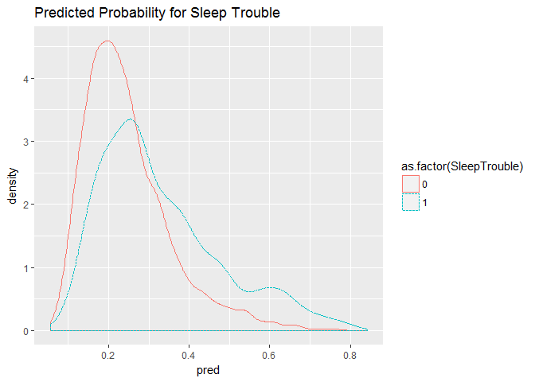

``` r
# pick a threshold and get confusion (prediction) matrix
# test a classifier with a threshold > 0.20
ctab <- table(pred=people$pred>0.2, SleepTrouble=people$SleepTrouble)
ctab
```

    ##        SleepTrouble
    ## pred       0    1
    ##   FALSE 1691  333
    ##   TRUE  2684 1273

``` r
# compute precision = true positives / predicted true
precision <- ctab[2,2]/sum(ctab[2,])
precision
```

    ## [1] 0.3217084

``` r
# compute recall = true positives / actual true
recall <- ctab[2,2]/sum(ctab[,2])
recall
```

    ## [1] 0.7926526

``` r
# look at ROC curve
library(pROC)
```

    ## Warning: package 'pROC' was built under R version 3.3.3

    ## Type 'citation("pROC")' for a citation.

    ## 
    ## Attaching package: 'pROC'

    ## The following objects are masked from 'package:stats':
    ## 
    ##     cov, smooth, var

``` r
roccurve <- roc(people$SleepTrouble ~ people$pred)
plot(roccurve)
```

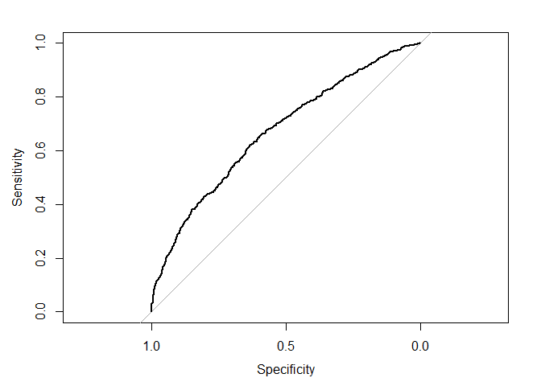

``` r
# pull out just the AUC statistic
auc(roccurve)
```

    ## Area under the curve: 0.6681

### NULL MODEL for Logistic Regression

We didn't cover this in class, but to get an "intercept-only" model you use a formula in the form of `outcome ~ 1` which basically says model the `outcome` variable as a function of the intercept indicated by the `1`. This formula can be used for any generalized linear modeling approach (linear regression, logistic regression, Poisson regression, etc). You'll notice in running the code steps below that using the intercept only approach does no better than flipping a coin which you see for the ROC curve which is a straight line and the AUC is 0.5 (50/50 guessing does as well as this null model with no predictors). You always want the AUC to be &gt;0.5 and as close to 1.0 as possible. AUCs &gt;0.7 are ok but you really want AUCs &gt;0.8 and &gt;0.9 is even better.

``` r
# NULL MODEL for Logistic Regression 
# is basically an intercept-only model with no predictors
logreg.null <- glm(SleepTrouble ~ 1, 
                   data=people, 
                   family=binomial(link="logit"))

summary(logreg.null)
```

    ## 
    ## Call:
    ## glm(formula = SleepTrouble ~ 1, family = binomial(link = "logit"), 
    ##     data = people)
    ## 
    ## Deviance Residuals: 
    ##     Min       1Q   Median       3Q      Max  
    ## -0.7908  -0.7908  -0.7908   1.6216   1.6216  
    ## 
    ## Coefficients:
    ##             Estimate Std. Error z value Pr(>|z|)    
    ## (Intercept) -1.00216    0.02918  -34.35   <2e-16 ***
    ## ---
    ## Signif. codes:  0 '***' 0.001 '**' 0.01 '*' 0.05 '.' 0.1 ' ' 1
    ## 
    ## (Dispersion parameter for binomial family taken to be 1)
    ## 
    ##     Null deviance: 6959.2  on 5980  degrees of freedom
    ## Residual deviance: 6959.2  on 5980  degrees of freedom
    ## AIC: 6961.2
    ## 
    ## Number of Fisher Scoring iterations: 4

``` r
people$pred.null <- predict(logreg.null, 
                       newdata=people, 
                       type="response")

# plot predicted probabilities
ggplot(people, 
       aes(x=pred.null, color=as.factor(SleepTrouble), 
           linetype=as.factor(SleepTrouble))) +
  geom_density() +
  ggtitle("Predicted Probability for Sleep Trouble - Null Model")
```

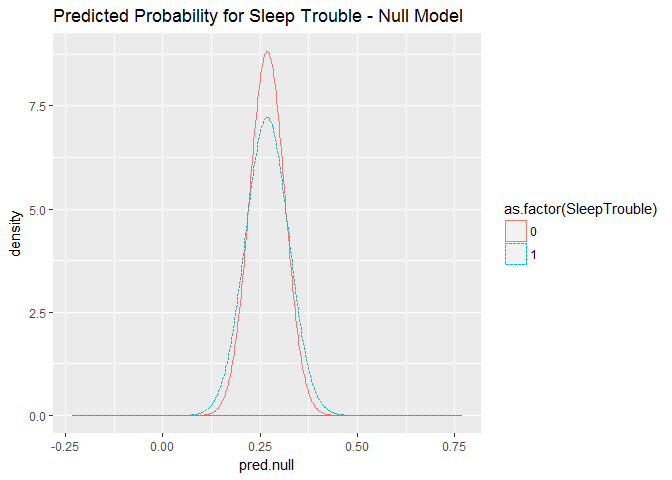

``` r
# pick a threshold and get confusion (prediction) matrix
# test a classifier with a threshold > 0.30
ctab <- table(pred=people$pred>0.3, SleepTrouble=people$SleepTrouble)
ctab
```

    ##        SleepTrouble
    ## pred       0    1
    ##   FALSE 3298  855
    ##   TRUE  1077  751

``` r
# compute precision = true positives / predicted true
precision <- ctab[2,2]/sum(ctab[2,])
precision
```

    ## [1] 0.4108315

``` r
# compute recall = true positives / actual true
recall <- ctab[2,2]/sum(ctab[,2])
recall
```

    ## [1] 0.4676214

``` r
# look at ROC curve
#library(pROC)
roccurve <- roc(people$SleepTrouble ~ people$pred.null)
plot(roccurve)
```

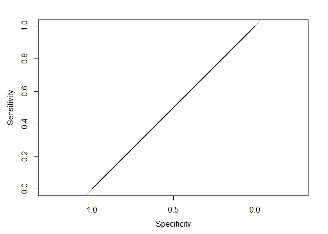

``` r
# pull out just the AUC statistic
auc(roccurve)
```

    ## Area under the curve: 0.5

### Try KNN to predict Sleep Trouble

``` r
# for knn, rpart and randomForest, set SleepTrouble
# back to being a factor
people$SleepTrouble <- as.factor(people$SleepTrouble)

# Apply knn procedure to predict Diabetes
# use the knn procedure in the class package
library(class)

# Let's try different values of k to see how that affects performance
knn.1 <- knn(train = people, test = people, cl = people$SleepTrouble, k = 1)
knn.3 <- knn(train = people, test = people, cl = people$SleepTrouble, k = 3)
knn.5 <- knn(train = people, test = people, cl = people$SleepTrouble, k = 5)
knn.20 <- knn(train = people, test = people, cl = people$SleepTrouble, k = 20)

# see how well they classified
# Calculate the percent predicted correctly

100*sum(people$SleepTrouble == knn.1)/length(knn.1)
```

    ## [1] 100

``` r
100*sum(people$SleepTrouble == knn.3)/length(knn.3)
```

    ## [1] 90.97141

``` r
100*sum(people$SleepTrouble == knn.5)/length(knn.5)
```

    ## [1] 87.10918

``` r
100*sum(people$SleepTrouble == knn.20)/length(knn.20)
```

    ## [1] 78.04715

``` r
#overall success
# Another way to look at success rate against increasing k

table(knn.1, people$SleepTrouble)
```

    ##      
    ## knn.1    0    1
    ##     0 4375    0
    ##     1    0 1606

``` r
table(knn.3, people$SleepTrouble)
```

    ##      
    ## knn.3    0    1
    ##     0 4193  358
    ##     1  182 1248

``` r
table(knn.5, people$SleepTrouble)
```

    ##      
    ## knn.5    0    1
    ##     0 4162  558
    ##     1  213 1048

``` r
table(knn.20, people$SleepTrouble)
```

    ##       
    ## knn.20    0    1
    ##      0 4275 1213
    ##      1  100  393

### (Version 1) The ensemble method - using the approach from lesson 10 with Age and BMI

The example here uses the same basic code we did in class for lesson 10. This looks at just Age and BMI and no other variables considered in the decision tree and random forest models. The plots also just consider Age and BMI.

``` r
library(mosaic)
```

    ## Warning: package 'mosaic' was built under R version 3.3.3

    ## Loading required package: lattice

    ## Warning: package 'lattice' was built under R version 3.3.3

    ## Loading required package: mosaicData

    ## Warning: package 'mosaicData' was built under R version 3.3.3

    ## Loading required package: Matrix

    ## Warning: package 'Matrix' was built under R version 3.3.3

    ## 
    ## The 'mosaic' package masks several functions from core packages in order to add additional features.  
    ## The original behavior of these functions should not be affected by this.

    ## 
    ## Attaching package: 'mosaic'

    ## The following object is masked from 'package:Matrix':
    ## 
    ##     mean

    ## The following objects are masked from 'package:pROC':
    ## 
    ##     cov, var

    ## The following objects are masked from 'package:dplyr':
    ## 
    ##     count, do, tally

    ## The following objects are masked from 'package:stats':
    ## 
    ##     binom.test, cor, cov, D, fivenum, IQR, median, prop.test,
    ##     quantile, sd, t.test, var

    ## The following objects are masked from 'package:base':
    ## 
    ##     max, mean, min, prod, range, sample, sum

``` r
# Create the grid
ages <- mosaic::range(~ Age, data = people)
bmis <- mosaic::range(~ BMI, data = people)
res <- 100
fake_grid <- expand.grid(
  Age = seq(from = ages[1], to = ages[2], length.out = res),
  BMI = seq(from = bmis[1], to = bmis[2], length.out = res))

#Get the overall proportion, p, of people with Sleep Trouble
p <- sum(people$SleepTrouble == 1)/length(people$SleepTrouble)
p
```

    ## [1] 0.268517

``` r
# Null model prediction
pred_null <- rep(p, nrow(fake_grid))

form <- as.formula("SleepTrouble ~ Age + BMI")

library(rpart)
# Evaluate each model on each grid point
# For the decision tree
dmod_tree <- rpart(form, data = people, 
                   control = rpart.control(cp = 0.005, minbucket = 30))

# results summary
dmod_tree
```

    ## n= 5981 
    ## 
    ## node), split, n, loss, yval, (yprob)
    ##       * denotes terminal node
    ## 
    ## 1) root 5981 1606 0 (0.7314830 0.2685170) *

``` r
# For the forest
set.seed(20371)
#dmod_forest <- rfsrc(form, data = people, 
#                     ntree = 201, mtry = 3)
# try with randomForest instead of randomForestSRC package
library(randomForest)
```

    ## randomForest 4.6-12

    ## Type rfNews() to see new features/changes/bug fixes.

    ## 
    ## Attaching package: 'randomForest'

    ## The following object is masked from 'package:ggplot2':
    ## 
    ##     margin

    ## The following object is masked from 'package:dplyr':
    ## 
    ##     combine

``` r
dmod_forest <- randomForest(form, data = people, 
                     ntree = 201, mtry = 2)

# results summary
dmod_forest
```

    ## 
    ## Call:
    ##  randomForest(formula = form, data = people, ntree = 201, mtry = 2) 
    ##                Type of random forest: classification
    ##                      Number of trees: 201
    ## No. of variables tried at each split: 2
    ## 
    ##         OOB estimate of  error rate: 14.18%
    ## Confusion matrix:
    ##      0    1 class.error
    ## 0 4011  364   0.0832000
    ## 1  484 1122   0.3013699

``` r
# Now the predictions for tree and forest
#pred_tree <- predict(dmod_tree, newdata = fake_grid)[, "Yes"]
pred_tree <- predict(dmod_tree, newdata = fake_grid)[,1]
summary(pred_tree)
```

    ##    Min. 1st Qu.  Median    Mean 3rd Qu.    Max. 
    ##  0.7315  0.7315  0.7315  0.7315  0.7315  0.7315

``` r
#table(pred_tree)

# pred_tree <- predict(dmod_tree, newdata = fake_grid)[, 1]
#pred_forest <- predict(dmod_forest, newdata = fake_grid, 
#                       type = "prob")[, "Yes"]
pred_forest <- predict(dmod_forest, newdata = fake_grid, type = "prob")[,1]
summary(pred_forest)
```

    ##     Min.  1st Qu.   Median     Mean  3rd Qu.     Max. 
    ## 0.004975 0.447800 0.666700 0.633400 0.850700 1.000000

``` r
#table(pred_forest)

# K-nearest neighbor prediction
pred_knn <- people %>%
  select(Age, BMI) %>%
  knn(test=select(fake_grid, Age, BMI), cl = people$SleepTrouble, k=5) %>%
  as.numeric() - 1
```

Next, we want to build a dataframe with all of these predicted models, then `gather()` it into a long format.

``` r
library(tidyr)
```

    ## Warning: package 'tidyr' was built under R version 3.3.3

    ## 
    ## Attaching package: 'tidyr'

    ## The following object is masked from 'package:Matrix':
    ## 
    ##     expand

``` r
# build the data frame
res <- fake_grid %>%
  mutate(
    "Null" = pred_null, 
    "Decision Tree" = pred_tree,
    "Random Forest" = pred_forest, 
    "K-nearest neighbor" = pred_knn) %>%
  gather(k="model", value = "y_hat", -Age, -BMI)
```

    ## Warning: attributes are not identical across measure variables; they will
    ## be dropped

Next let's plot all of these

``` r
ggplot(data = res, aes(x = Age, y = BMI)) +
  geom_tile(aes(fill=y_hat), color = NA) +
  geom_count(aes(color = SleepTrouble), alpha = 0.4, data = people) +
  scale_fill_gradient(low = "white", high = "blue") +
  scale_color_manual(values = c("gray", "gold")) +
  scale_size(range = c(0,2)) +
  scale_x_continuous(expand = c(0.02, 0)) +
  scale_y_continuous(expand = c(0.02, 0)) +
  facet_wrap(~model)
```

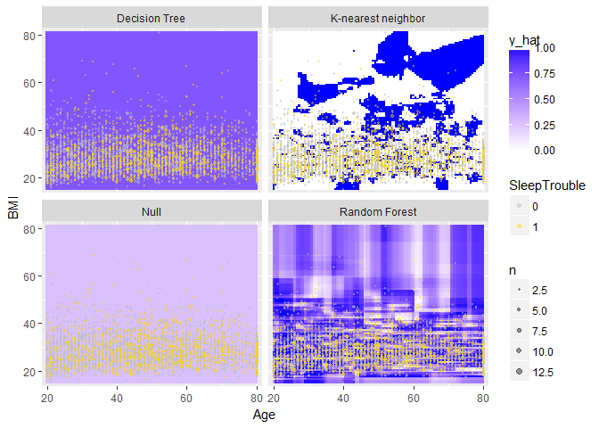

### (Version 2): The ensemble method - using all 10 variables I choose

The decision tree (`rpart`) and random forest models below use the 10 variables I selected. I then modified the plots to look at the effects of Age and Poverty insead of Age and BMI. I also added plots to show the decision tree and the variable importance plot from random forest so you can see that indeed BMI, Age and Poverty are indeed important in predicting sleep trouble.

``` r
people <- people %>%
  select(Age, Gender, MaritalStatus, Poverty,
         HomeOwn, BMI, Diabetes, HealthGen, Depressed,
         PhysActive, SleepTrouble)
  
# note: all variables are numeric now, except
# SleepTriuble which is a factor, but coded 0 for no and 1 for yes
  
# This time let's look at Age and Poverty instead
# of Age and BMI
#library(mosaic)
# Create the grid
#ages <- mosaic::range(~ Age, data = people)
#povs <- mosaic::range(~ Poverty, data = people)
#res <- 100
#fake_grid <- expand.grid(
#  Age = seq(from = ages[1], to = ages[2], length.out = res),
#  Poverty = seq(from = povs[1], to = povs[2], length.out = res))

#Get the overall proportion, p, of people with Sleep Trouble
p <- sum(people$SleepTrouble == 1)/length(people$SleepTrouble)
p
```

    ## [1] 0.268517

``` r
# Null model prediction
pred_null <- rep(p, nrow(people))

form <- as.formula("SleepTrouble ~ .")

#library(rpart)
# Evaluate each model on each grid point
# For the decision tree
dmod_tree <- rpart(form, data = people, 
                   control = rpart.control(cp = 0.005, minbucket = 30))

# results summary
dmod_tree
```

    ## n= 5981 
    ## 
    ## node), split, n, loss, yval, (yprob)
    ##       * denotes terminal node
    ## 
    ##   1) root 5981 1606 0 (0.7314830 0.2685170)  
    ##     2) Depressed< 1.5 4721 1055 0 (0.7765304 0.2234696)  
    ##       4) Age< 43.5 2050  345 0 (0.8317073 0.1682927) *
    ##       5) Age>=43.5 2671  710 0 (0.7341820 0.2658180)  
    ##        10) BMI< 38.985 2489  624 0 (0.7492969 0.2507031) *
    ##        11) BMI>=38.985 182   86 0 (0.5274725 0.4725275)  
    ##          22) Poverty< 4.965 129   47 0 (0.6356589 0.3643411) *
    ##          23) Poverty>=4.965 53   14 1 (0.2641509 0.7358491) *
    ##     3) Depressed>=1.5 1260  551 0 (0.5626984 0.4373016)  
    ##       6) Age< 33.5 325  100 0 (0.6923077 0.3076923) *
    ##       7) Age>=33.5 935  451 0 (0.5176471 0.4823529)  
    ##        14) HealthGen< 2.5 258   88 0 (0.6589147 0.3410853) *
    ##        15) HealthGen>=2.5 677  314 1 (0.4638109 0.5361891)  
    ##          30) Depressed< 2.5 453  213 0 (0.5298013 0.4701987)  
    ##            60) Gender>=1.5 219   86 0 (0.6073059 0.3926941) *
    ##            61) Gender< 1.5 234  107 1 (0.4572650 0.5427350)  
    ##             122) Poverty>=2.69 87   33 0 (0.6206897 0.3793103) *
    ##             123) Poverty< 2.69 147   53 1 (0.3605442 0.6394558) *
    ##          31) Depressed>=2.5 224   74 1 (0.3303571 0.6696429) *

``` r
# draw the tree - see example
# in the help at help(plot.rpart)
par(xpd = TRUE)
plot(dmod_tree, compress = TRUE)
text(dmod_tree, use.n = TRUE)
```

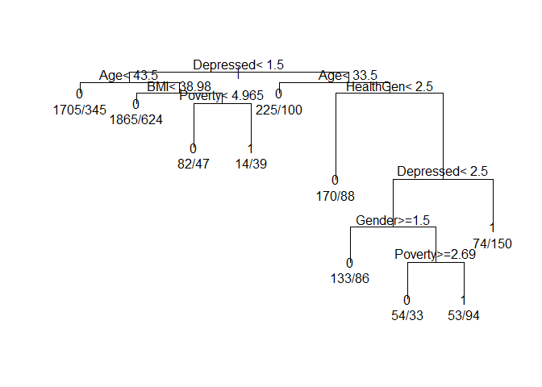

``` r
# age and BMI are near the top, but 
# so is Depressed and Poverty


# For the forest
set.seed(20371)
#dmod_forest <- rfsrc(form, data = people, 
#                     ntree = 201, mtry = 3)
# try with randomForest instead of randomForestSRC package
#library(randomForest)
dmod_forest <- randomForest(form, data = people, 
                     ntree = 201, mtry = 2)

# results summary
dmod_forest
```

    ## 
    ## Call:
    ##  randomForest(formula = form, data = people, ntree = 201, mtry = 2) 
    ##                Type of random forest: classification
    ##                      Number of trees: 201
    ## No. of variables tried at each split: 2
    ## 
    ##         OOB estimate of  error rate: 18.66%
    ## Confusion matrix:
    ##      0   1 class.error
    ## 0 4283  92  0.02102857
    ## 1 1024 582  0.63760897

``` r
varImpPlot(dmod_forest)
```

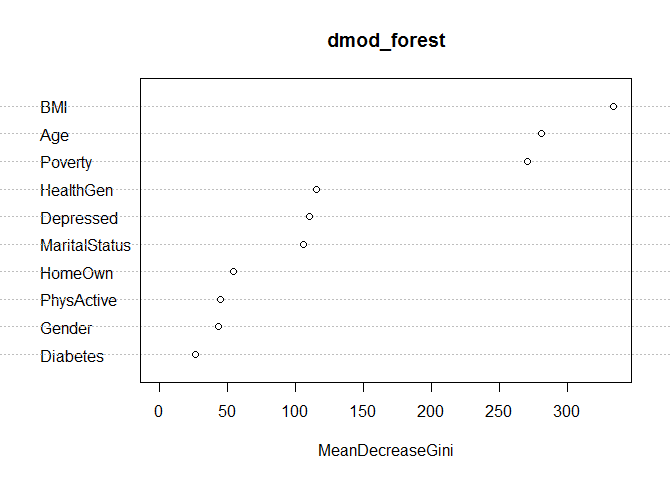

``` r
# you'll notice that BMI and Age are at the top
# of this Variable Important plot
# also near the top is the Poverty level

# Now the predictions for tree and forest
# just compute prediction from original data for now
pred_tree <- predict(dmod_tree)[,1]
summary(pred_tree)
```

    ##    Min. 1st Qu.  Median    Mean 3rd Qu.    Max. 
    ##  0.2642  0.7493  0.7493  0.7315  0.8317  0.8317

``` r
#table(pred_tree)

# pred_tree <- predict(dmod_tree, newdata = fake_grid)[, 1]
#pred_forest <- predict(dmod_forest, newdata = fake_grid, 
#                       type = "prob")[, "Yes"]
pred_forest <- predict(dmod_forest, type = "prob")[,1]
summary(pred_forest)
```

    ##    Min. 1st Qu.  Median    Mean 3rd Qu.    Max. 
    ## 0.02778 0.70110 0.88610 0.80180 0.96050 1.00000

``` r
#table(pred_forest)

# K-nearest neighbor prediction
# but look at Age and Poverty
pred_knn <- people %>%
  knn(test=people, cl = people$SleepTrouble, k=5) %>%
  as.numeric() - 1
```

Next, we want to build a dataframe with all of these predicted models, then `gather()` it into a long format.

``` r
#library(tidyr)

# build the data frame

res <- people %>%
  mutate(
    "Null" = pred_null, 
    "Decision Tree" = pred_tree,
    "Random Forest" = pred_forest, 
    "K-nearest neighbor" = pred_knn) %>%
  gather(k="model", value = "y_hat", -Age, -Gender,
         -MaritalStatus, -Poverty, -HomeOwn, -BMI,
         -Diabetes, -HealthGen, -Depressed, -PhysActive,
         -SleepTrouble)
```

    ## Warning: attributes are not identical across measure variables; they will
    ## be dropped

Next let's plot all of these

``` r
ggplot(data = res, aes(x = Age, y = Poverty)) +
  geom_tile(aes(fill=y_hat), color = NA) +
  geom_count(aes(color = SleepTrouble), alpha = 0.4, data = people) +
  scale_fill_gradient(low = "white", high = "blue") +
  scale_color_manual(values = c("gray", "gold")) +
  scale_size(range = c(0,2)) +
  scale_x_continuous(expand = c(0.02, 0)) +
  scale_y_continuous(expand = c(0.02, 0)) +
  facet_wrap(~model)
```

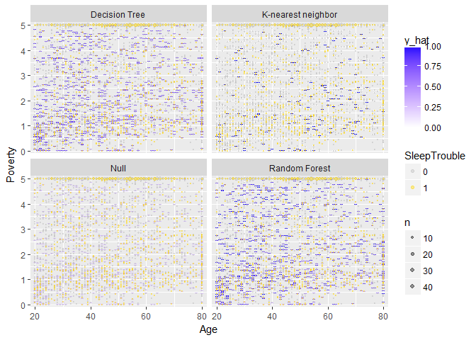

------------------------------------------------------------------------

PART 2 - Build "classifiers" for `SleepHrsNight`
------------------------------------------------

For each of the model types (null model, logistic regression, decision tree, random forest, k-nearest neighbor):

-   1A. Build the classifier.
-   1B. Report its effectiveness on the NHANES dataset.
-   1C. Make an appropriate visualization of this model.
-   1D. Interpret the results. What have you learned about people's sleeping habits?

### Suppose we recode `SleepHrsNight` into optimal and suboptimal sleep

To use the code similar to what we did above, it'll be best to create a categorical.binary outcome. Let's suppose that if the person got 7-9 hours of sleep each night that is optimal sleep time, but any sleep times less than 7 hours or more than 9 hours is considered suboptimal.

I'll use the same approach as above and same variable subset.

``` r
# build dataset for these 10 variables and SleepHrsNight
people <- NHANES %>% 
  select(Age, Gender, MaritalStatus, Poverty, HomeOwn,
         BMI, Diabetes, HealthGen, Depressed, PhysActive,
         SleepHrsNight) 

# run summary
summary(people)
```

    ##       Age           Gender          MaritalStatus     Poverty     
    ##  Min.   : 0.00   female:5020   Divorced    : 707   Min.   :0.000  
    ##  1st Qu.:17.00   male  :4980   LivePartner : 560   1st Qu.:1.240  
    ##  Median :36.00                 Married     :3945   Median :2.700  
    ##  Mean   :36.74                 NeverMarried:1380   Mean   :2.802  
    ##  3rd Qu.:54.00                 Separated   : 183   3rd Qu.:4.710  
    ##  Max.   :80.00                 Widowed     : 456   Max.   :5.000  
    ##                                NA's        :2769   NA's   :726    
    ##   HomeOwn          BMI        Diabetes        HealthGen      Depressed   
    ##  Own  :6425   Min.   :12.88   No  :9098   Excellent: 878   None   :5246  
    ##  Rent :3287   1st Qu.:21.58   Yes : 760   Vgood    :2508   Several:1009  
    ##  Other: 225   Median :25.98   NA's: 142   Good     :2956   Most   : 418  
    ##  NA's :  63   Mean   :26.66               Fair     :1010   NA's   :3327  
    ##               3rd Qu.:30.89               Poor     : 187                 
    ##               Max.   :81.25               NA's     :2461                 
    ##               NA's   :366                                                
    ##  PhysActive  SleepHrsNight   
    ##  No  :3677   Min.   : 2.000  
    ##  Yes :4649   1st Qu.: 6.000  
    ##  NA's:1674   Median : 7.000  
    ##              Mean   : 6.928  
    ##              3rd Qu.: 8.000  
    ##              Max.   :12.000  
    ##              NA's   :2245

``` r
# Convert back to dataframe
people <- as.data.frame(people)
glimpse(people)
```

    ## Observations: 10,000
    ## Variables: 11
    ## $ Age           <int> 34, 34, 34, 4, 49, 9, 8, 45, 45, 45, 66, 58, 54,...
    ## $ Gender        <fctr> male, male, male, male, female, male, male, fem...
    ## $ MaritalStatus <fctr> Married, Married, Married, NA, LivePartner, NA,...
    ## $ Poverty       <dbl> 1.36, 1.36, 1.36, 1.07, 1.91, 1.84, 2.33, 5.00, ...
    ## $ HomeOwn       <fctr> Own, Own, Own, Own, Rent, Rent, Own, Own, Own, ...
    ## $ BMI           <dbl> 32.22, 32.22, 32.22, 15.30, 30.57, 16.82, 20.64,...
    ## $ Diabetes      <fctr> No, No, No, No, No, No, No, No, No, No, No, No,...
    ## $ HealthGen     <fctr> Good, Good, Good, NA, Good, NA, NA, Vgood, Vgoo...
    ## $ Depressed     <fctr> Several, Several, Several, NA, Several, NA, NA,...
    ## $ PhysActive    <fctr> No, No, No, NA, No, NA, NA, Yes, Yes, Yes, Yes,...
    ## $ SleepHrsNight <int> 4, 4, 4, NA, 8, NA, NA, 8, 8, 8, 7, 5, 4, NA, 5,...

``` r
# Convert factors to numeric - the packages just seem to work better that way
people$Gender <- as.numeric(people$Gender)
people$MaritalStatus <- as.numeric(people$MaritalStatus)
people$HomeOwn <- as.numeric(people$HomeOwn)
people$Diabetes <- as.numeric(people$Diabetes)
people$HealthGen <- as.numeric(people$HealthGen)
people$Depressed <- as.numeric(people$Depressed)
people$PhysActive <- as.numeric(people$PhysActive)
people$SleepHrsNight <- as.numeric(people$SleepHrsNight)

summary(people)
```

    ##       Age            Gender      MaritalStatus      Poverty     
    ##  Min.   : 0.00   Min.   :1.000   Min.   :1.000   Min.   :0.000  
    ##  1st Qu.:17.00   1st Qu.:1.000   1st Qu.:3.000   1st Qu.:1.240  
    ##  Median :36.00   Median :1.000   Median :3.000   Median :2.700  
    ##  Mean   :36.74   Mean   :1.498   Mean   :3.158   Mean   :2.802  
    ##  3rd Qu.:54.00   3rd Qu.:2.000   3rd Qu.:4.000   3rd Qu.:4.710  
    ##  Max.   :80.00   Max.   :2.000   Max.   :6.000   Max.   :5.000  
    ##                                  NA's   :2769    NA's   :726    
    ##     HomeOwn           BMI           Diabetes       HealthGen    
    ##  Min.   :1.000   Min.   :12.88   Min.   :1.000   Min.   :1.000  
    ##  1st Qu.:1.000   1st Qu.:21.58   1st Qu.:1.000   1st Qu.:2.000  
    ##  Median :1.000   Median :25.98   Median :1.000   Median :3.000  
    ##  Mean   :1.376   Mean   :26.66   Mean   :1.077   Mean   :2.618  
    ##  3rd Qu.:2.000   3rd Qu.:30.89   3rd Qu.:1.000   3rd Qu.:3.000  
    ##  Max.   :3.000   Max.   :81.25   Max.   :2.000   Max.   :5.000  
    ##  NA's   :63      NA's   :366     NA's   :142     NA's   :2461   
    ##    Depressed       PhysActive    SleepHrsNight   
    ##  Min.   :1.000   Min.   :1.000   Min.   : 2.000  
    ##  1st Qu.:1.000   1st Qu.:1.000   1st Qu.: 6.000  
    ##  Median :1.000   Median :2.000   Median : 7.000  
    ##  Mean   :1.276   Mean   :1.558   Mean   : 6.928  
    ##  3rd Qu.:1.000   3rd Qu.:2.000   3rd Qu.: 8.000  
    ##  Max.   :3.000   Max.   :2.000   Max.   :12.000  
    ##  NA's   :3327    NA's   :1674    NA's   :2245

``` r
dim(people)
```

    ## [1] 10000    11

``` r
# drop any cases/rows with missing data
# this step creates a complete cases dataset
people <- na.omit(people)
summary(people)
```

    ##       Age            Gender      MaritalStatus      Poverty     
    ##  Min.   :20.00   Min.   :1.000   Min.   :1.000   Min.   :0.000  
    ##  1st Qu.:33.00   1st Qu.:1.000   1st Qu.:3.000   1st Qu.:1.390  
    ##  Median :47.00   Median :2.000   Median :3.000   Median :3.010  
    ##  Mean   :47.36   Mean   :1.504   Mean   :3.133   Mean   :2.991  
    ##  3rd Qu.:60.00   3rd Qu.:2.000   3rd Qu.:4.000   3rd Qu.:5.000  
    ##  Max.   :80.00   Max.   :2.000   Max.   :6.000   Max.   :5.000  
    ##     HomeOwn           BMI           Diabetes       HealthGen    
    ##  Min.   :1.000   Min.   :15.02   Min.   :1.000   Min.   :1.000  
    ##  1st Qu.:1.000   1st Qu.:24.20   1st Qu.:1.000   1st Qu.:2.000  
    ##  Median :1.000   Median :27.90   Median :1.000   Median :3.000  
    ##  Mean   :1.343   Mean   :28.91   Mean   :1.104   Mean   :2.627  
    ##  3rd Qu.:2.000   3rd Qu.:32.36   3rd Qu.:1.000   3rd Qu.:3.000  
    ##  Max.   :3.000   Max.   :81.25   Max.   :2.000   Max.   :5.000  
    ##    Depressed      PhysActive    SleepHrsNight   
    ##  Min.   :1.00   Min.   :1.000   Min.   : 2.000  
    ##  1st Qu.:1.00   1st Qu.:1.000   1st Qu.: 6.000  
    ##  Median :1.00   Median :2.000   Median : 7.000  
    ##  Mean   :1.27   Mean   :1.541   Mean   : 6.903  
    ##  3rd Qu.:1.00   3rd Qu.:2.000   3rd Qu.: 8.000  
    ##  Max.   :3.00   Max.   :2.000   Max.   :12.000

``` r
dim(people)
```

    ## [1] 5968   11

``` r
# recode into optimal and suboptimal sleep times
# if hours is between 7 and 9 set outcome to 1, else set to 0
people$SleepOptimal <- ifelse((people$SleepHrsNight <= 9 &
                                 people$SleepHrsNight >= 7), 1, 0)
```

### Run Logistic Regression - predict Sleep Trouble

``` r
# drop SleepHrsNight
people <- people %>% select(-SleepHrsNight)

# model SleepTrouble by rest of variables in people dataset
fmla <- "SleepOptimal ~ ."

logreg <- glm(fmla, 
              data=people, 
              family=binomial(link="logit"))

summary(logreg)
```

    ## 
    ## Call:
    ## glm(formula = fmla, family = binomial(link = "logit"), data = people)
    ## 
    ## Deviance Residuals: 
    ##     Min       1Q   Median       3Q      Max  
    ## -1.8534  -1.2663   0.7831   0.9690   1.6859  
    ## 
    ## Coefficients:
    ##                Estimate Std. Error z value Pr(>|z|)    
    ## (Intercept)    1.617923   0.271054   5.969 2.39e-09 ***
    ## Age            0.002616   0.001818   1.439  0.15023    
    ## Gender        -0.175345   0.055329  -3.169  0.00153 ** 
    ## MaritalStatus -0.008895   0.024289  -0.366  0.71419    
    ## Poverty        0.046104   0.018982   2.429  0.01515 *  
    ## HomeOwn       -0.185381   0.058362  -3.176  0.00149 ** 
    ## BMI           -0.002653   0.004263  -0.622  0.53368    
    ## Diabetes      -0.049788   0.094796  -0.525  0.59943    
    ## HealthGen     -0.276983   0.033019  -8.388  < 2e-16 ***
    ## Depressed     -0.319782   0.049388  -6.475 9.49e-11 ***
    ## PhysActive     0.285746   0.058478   4.886 1.03e-06 ***
    ## ---
    ## Signif. codes:  0 '***' 0.001 '**' 0.01 '*' 0.05 '.' 0.1 ' ' 1
    ## 
    ## (Dispersion parameter for binomial family taken to be 1)
    ## 
    ##     Null deviance: 7925.4  on 5967  degrees of freedom
    ## Residual deviance: 7612.4  on 5957  degrees of freedom
    ## AIC: 7634.4
    ## 
    ## Number of Fisher Scoring iterations: 4

``` r
people$pred <- predict(logreg, 
                       newdata=people, 
                       type="response")

# plot predicted probabilities
ggplot(people, 
       aes(x=pred, color=as.factor(SleepOptimal), 
           linetype=as.factor(SleepOptimal))) +
  geom_density() +
  ggtitle("Predicted Probability for Sleep Optimal")
```

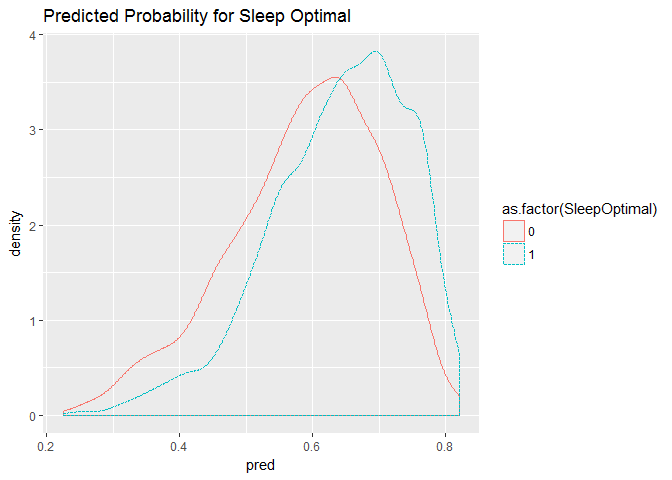

``` r
# pick a threshold and get confusion (prediction) matrix
# test a classifier with a threshold > 0.70
ctab <- table(pred=people$pred>0.7, SleepOptimal=people$SleepOptimal)
ctab
```

    ##        SleepOptimal
    ## pred       0    1
    ##   FALSE 1888 2523
    ##   TRUE   379 1178

``` r
# compute precision = true positives / predicted true
precision <- ctab[2,2]/sum(ctab[2,])
precision
```

    ## [1] 0.7565832

``` r
# compute recall = true positives / actual true
recall <- ctab[2,2]/sum(ctab[,2])
recall
```

    ## [1] 0.3182924

``` r
# look at ROC curve
library(pROC)
roccurve <- roc(people$SleepOptimal ~ people$pred)
plot(roccurve)
```

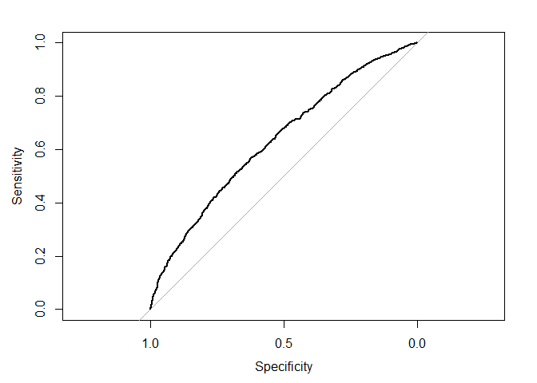

``` r
# pull out just the AUC statistic
auc(roccurve)
```

    ## Area under the curve: 0.6327

### NULL MODEL for Logistic Regression

We didn't cover this in class, but to get an "intercept-only" model you use a formula in the form of `outcome ~ 1` which basically says model the `outcome` variable as a function of the intercept indicated by the `1`. This formula can be used for any generalized linear modeling approach (linear regression, logistic regression, Poisson regression, etc). You'll notice in running the code steps below that using the intercept only approach does no better than flipping a coin which you see for the ROC curve which is a straight line and the AUC is 0.5 (50/50 guessing does as well as this null model with no predictors). You always want the AUC to be &gt;0.5 and as close to 1.0 as possible. AUCs &gt;0.7 are ok but you really want AUCs &gt;0.8 and &gt;0.9 is even better.

``` r
# NULL MODEL for Logistic Regression 
# is basically an intercept-only model with no predictors
logreg.null <- glm(SleepOptimal ~ 1, 
                   data=people, 
                   family=binomial(link="logit"))

summary(logreg.null)
```

    ## 
    ## Call:
    ## glm(formula = SleepOptimal ~ 1, family = binomial(link = "logit"), 
    ##     data = people)
    ## 
    ## Deviance Residuals: 
    ##     Min       1Q   Median       3Q      Max  
    ## -1.3914  -1.3914   0.9776   0.9776   0.9776  
    ## 
    ## Coefficients:
    ##             Estimate Std. Error z value Pr(>|z|)    
    ## (Intercept)  0.49015    0.02667   18.38   <2e-16 ***
    ## ---
    ## Signif. codes:  0 '***' 0.001 '**' 0.01 '*' 0.05 '.' 0.1 ' ' 1
    ## 
    ## (Dispersion parameter for binomial family taken to be 1)
    ## 
    ##     Null deviance: 7925.4  on 5967  degrees of freedom
    ## Residual deviance: 7925.4  on 5967  degrees of freedom
    ## AIC: 7927.4
    ## 
    ## Number of Fisher Scoring iterations: 4

``` r
people$pred.null <- predict(logreg.null, 
                       newdata=people, 
                       type="response")

# plot predicted probabilities
ggplot(people, 
       aes(x=pred.null, color=as.factor(SleepOptimal), 
           linetype=as.factor(SleepOptimal))) +
  geom_density() +
  ggtitle("Predicted Probability for Sleep Optimal - Null Model")
```

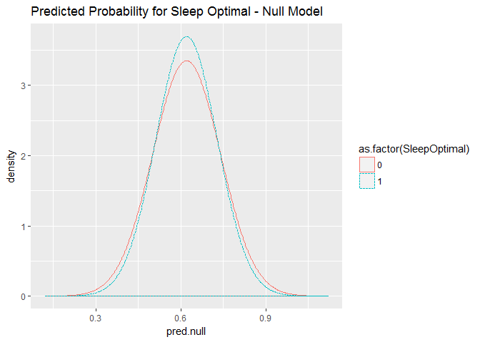

``` r
# look at ROC curve
#library(pROC)
roccurve <- roc(people$SleepOptimal ~ people$pred.null)
plot(roccurve)
```


``` r
# pull out just the AUC statistic
auc(roccurve)
```

    ## Area under the curve: 0.5

### Try KNN to predict Sleep Optimal

``` r
# for knn, rpart and randomForest, set SleepOptimal
# back to being a factor
people$SleepOptimal <- as.factor(people$SleepOptimal)

# Apply knn procedure to predict Diabetes
# use the knn procedure in the class package
library(class)

# Let's try different values of k to see how that affects performance
knn.1 <- knn(train = people, test = people, cl = people$SleepOptimal, k = 1)
knn.3 <- knn(train = people, test = people, cl = people$SleepOptimal, k = 3)
knn.5 <- knn(train = people, test = people, cl = people$SleepOptimal, k = 5)
knn.20 <- knn(train = people, test = people, cl = people$SleepOptimal, k = 20)

# see how well they classified
# Calculate the percent predicted correctly

100*sum(people$SleepOptimal == knn.1)/length(knn.1)
```

    ## [1] 100

``` r
100*sum(people$SleepOptimal == knn.3)/length(knn.3)
```

    ## [1] 89.62802

``` r
100*sum(people$SleepOptimal == knn.5)/length(knn.5)
```

    ## [1] 86.17627

``` r
100*sum(people$SleepOptimal == knn.20)/length(knn.20)
```

    ## [1] 78.03284

``` r
#overall success
# Another way to look at success rate against increasing k

table(knn.1, people$SleepOptimal)
```

    ##      
    ## knn.1    0    1
    ##     0 2267    0
    ##     1    0 3701

``` r
table(knn.3, people$SleepOptimal)
```

    ##      
    ## knn.3    0    1
    ##     0 1889  241
    ##     1  378 3460

``` r
table(knn.5, people$SleepOptimal)
```

    ##      
    ## knn.5    0    1
    ##     0 1724  282
    ##     1  543 3419

``` r
table(knn.20, people$SleepOptimal)
```

    ##       
    ## knn.20    0    1
    ##      0 1179  223
    ##      1 1088 3478

### (Version 1) The ensemble method - using the approach from lesson 10 with Age and BMI

The example here uses the same basic code we did in class for lesson 10. This looks at just Age and BMI and no other variables considered in the decision tree and random forest models. The plots also just consider Age and BMI.

``` r
library(mosaic)
# Create the grid
ages <- mosaic::range(~ Age, data = people)
bmis <- mosaic::range(~ BMI, data = people)
res <- 100
fake_grid <- expand.grid(
  Age = seq(from = ages[1], to = ages[2], length.out = res),
  BMI = seq(from = bmis[1], to = bmis[2], length.out = res))

#Get the overall proportion, p, of people with Sleep Trouble
p <- sum(people$SleepOptimal == 1)/length(people$SleepOptimal)
p
```

    ## [1] 0.6201408

``` r
# Null model prediction
pred_null <- rep(p, nrow(fake_grid))

form <- as.formula("SleepOptimal ~ Age + BMI")

library(rpart)
# Evaluate each model on each grid point
# For the decision tree
dmod_tree <- rpart(form, data = people, 
                   control = rpart.control(cp = 0.005, minbucket = 30))

# results summary
dmod_tree
```

    ## n= 5968 
    ## 
    ## node), split, n, loss, yval, (yprob)
    ##       * denotes terminal node
    ## 
    ## 1) root 5968 2267 1 (0.3798592 0.6201408) *

``` r
# For the forest
set.seed(20371)
#dmod_forest <- rfsrc(form, data = people, 
#                     ntree = 201, mtry = 3)
# try with randomForest instead of randomForestSRC package
library(randomForest)
dmod_forest <- randomForest(form, data = people, 
                     ntree = 201, mtry = 2)

# results summary
dmod_forest
```

    ## 
    ## Call:
    ##  randomForest(formula = form, data = people, ntree = 201, mtry = 2) 
    ##                Type of random forest: classification
    ##                      Number of trees: 201
    ## No. of variables tried at each split: 2
    ## 
    ##         OOB estimate of  error rate: 19.59%
    ## Confusion matrix:
    ##      0    1 class.error
    ## 0 1607  660   0.2911337
    ## 1  509 3192   0.1375304

``` r
# Now the predictions for tree and forest
#pred_tree <- predict(dmod_tree, newdata = fake_grid)[, "Yes"]
pred_tree <- predict(dmod_tree, newdata = fake_grid)[,1]
summary(pred_tree)
```

    ##    Min. 1st Qu.  Median    Mean 3rd Qu.    Max. 
    ##  0.3799  0.3799  0.3799  0.3799  0.3799  0.3799

``` r
#table(pred_tree)

# pred_tree <- predict(dmod_tree, newdata = fake_grid)[, 1]
#pred_forest <- predict(dmod_forest, newdata = fake_grid, 
#                       type = "prob")[, "Yes"]
pred_forest <- predict(dmod_forest, newdata = fake_grid, type = "prob")[,1]
summary(pred_forest)
```

    ##    Min. 1st Qu.  Median    Mean 3rd Qu.    Max. 
    ##  0.0000  0.2189  0.3930  0.4369  0.6567  0.9950

``` r
#table(pred_forest)

# K-nearest neighbor prediction
pred_knn <- people %>%
  select(Age, BMI) %>%
  knn(test=select(fake_grid, Age, BMI), cl = people$SleepOptimal, k=5) %>%
  as.numeric() - 1
```

Next, we want to build a dataframe with all of these predicted models, then `gather()` it into a long format.

``` r
library(tidyr)

# build the data frame
res <- fake_grid %>%
  mutate(
    "Null" = pred_null, 
    "Decision Tree" = pred_tree,
    "Random Forest" = pred_forest, 
    "K-nearest neighbor" = pred_knn) %>%
  gather(k="model", value = "y_hat", -Age, -BMI)
```

    ## Warning: attributes are not identical across measure variables; they will
    ## be dropped

Next let's plot all of these

``` r
ggplot(data = res, aes(x = Age, y = BMI)) +
  geom_tile(aes(fill=y_hat), color = NA) +
  geom_count(aes(color = SleepOptimal), alpha = 0.4, data = people) +
  scale_fill_gradient(low = "white", high = "blue") +
  scale_color_manual(values = c("gray", "gold")) +
  scale_size(range = c(0,2)) +
  scale_x_continuous(expand = c(0.02, 0)) +
  scale_y_continuous(expand = c(0.02, 0)) +
  facet_wrap(~model)
```

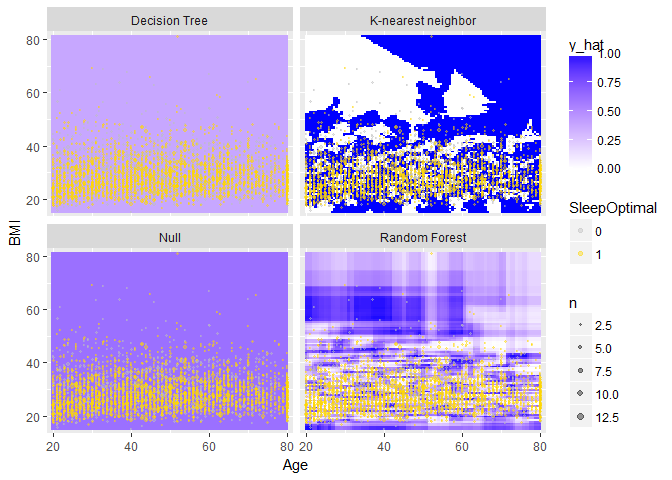

An Analysis of `SleepHrsNight` as a Continuous/Numeric Outcome Variable
-----------------------------------------------------------------------

We could also analyze sleep hours per night using the original continuous/numeric data.

### Linear Regression

So, instead of running a logistic regression model for a binary/categorical outcome, we'll run a linear regression for `SleepHrsNight` as a numeric/continuous outcome. After running the model, the predictions are saved and then plotted against the original values. As you can see in the plot below, the model does not do a very good job. THe adjusted R2 is only 0.04 and the predicted sleep times are very narrow (basically around the mean) and do not lie along a y=x reference line.

``` r
# build dataset for these 10 variables and SleepHrsNight
people <- NHANES %>% 
  select(Age, Gender, MaritalStatus, Poverty, HomeOwn,
         BMI, Diabetes, HealthGen, Depressed, PhysActive,
         SleepHrsNight) 

# run summary
summary(people)
```

    ##       Age           Gender          MaritalStatus     Poverty     
    ##  Min.   : 0.00   female:5020   Divorced    : 707   Min.   :0.000  
    ##  1st Qu.:17.00   male  :4980   LivePartner : 560   1st Qu.:1.240  
    ##  Median :36.00                 Married     :3945   Median :2.700  
    ##  Mean   :36.74                 NeverMarried:1380   Mean   :2.802  
    ##  3rd Qu.:54.00                 Separated   : 183   3rd Qu.:4.710  
    ##  Max.   :80.00                 Widowed     : 456   Max.   :5.000  
    ##                                NA's        :2769   NA's   :726    
    ##   HomeOwn          BMI        Diabetes        HealthGen      Depressed   
    ##  Own  :6425   Min.   :12.88   No  :9098   Excellent: 878   None   :5246  
    ##  Rent :3287   1st Qu.:21.58   Yes : 760   Vgood    :2508   Several:1009  
    ##  Other: 225   Median :25.98   NA's: 142   Good     :2956   Most   : 418  
    ##  NA's :  63   Mean   :26.66               Fair     :1010   NA's   :3327  
    ##               3rd Qu.:30.89               Poor     : 187                 
    ##               Max.   :81.25               NA's     :2461                 
    ##               NA's   :366                                                
    ##  PhysActive  SleepHrsNight   
    ##  No  :3677   Min.   : 2.000  
    ##  Yes :4649   1st Qu.: 6.000  
    ##  NA's:1674   Median : 7.000  
    ##              Mean   : 6.928  
    ##              3rd Qu.: 8.000  
    ##              Max.   :12.000  
    ##              NA's   :2245

``` r
# Convert back to dataframe
people <- as.data.frame(people)
glimpse(people)
```

    ## Observations: 10,000
    ## Variables: 11
    ## $ Age           <int> 34, 34, 34, 4, 49, 9, 8, 45, 45, 45, 66, 58, 54,...
    ## $ Gender        <fctr> male, male, male, male, female, male, male, fem...
    ## $ MaritalStatus <fctr> Married, Married, Married, NA, LivePartner, NA,...
    ## $ Poverty       <dbl> 1.36, 1.36, 1.36, 1.07, 1.91, 1.84, 2.33, 5.00, ...
    ## $ HomeOwn       <fctr> Own, Own, Own, Own, Rent, Rent, Own, Own, Own, ...
    ## $ BMI           <dbl> 32.22, 32.22, 32.22, 15.30, 30.57, 16.82, 20.64,...
    ## $ Diabetes      <fctr> No, No, No, No, No, No, No, No, No, No, No, No,...
    ## $ HealthGen     <fctr> Good, Good, Good, NA, Good, NA, NA, Vgood, Vgoo...
    ## $ Depressed     <fctr> Several, Several, Several, NA, Several, NA, NA,...
    ## $ PhysActive    <fctr> No, No, No, NA, No, NA, NA, Yes, Yes, Yes, Yes,...
    ## $ SleepHrsNight <int> 4, 4, 4, NA, 8, NA, NA, 8, 8, 8, 7, 5, 4, NA, 5,...

``` r
# Convert factors to numeric - the packages just seem to work better that way
people$Gender <- as.numeric(people$Gender)
people$MaritalStatus <- as.numeric(people$MaritalStatus)
people$HomeOwn <- as.numeric(people$HomeOwn)
people$Diabetes <- as.numeric(people$Diabetes)
people$HealthGen <- as.numeric(people$HealthGen)
people$Depressed <- as.numeric(people$Depressed)
people$PhysActive <- as.numeric(people$PhysActive)
people$SleepHrsNight <- as.numeric(people$SleepHrsNight)

summary(people)
```

    ##       Age            Gender      MaritalStatus      Poverty     
    ##  Min.   : 0.00   Min.   :1.000   Min.   :1.000   Min.   :0.000  
    ##  1st Qu.:17.00   1st Qu.:1.000   1st Qu.:3.000   1st Qu.:1.240  
    ##  Median :36.00   Median :1.000   Median :3.000   Median :2.700  
    ##  Mean   :36.74   Mean   :1.498   Mean   :3.158   Mean   :2.802  
    ##  3rd Qu.:54.00   3rd Qu.:2.000   3rd Qu.:4.000   3rd Qu.:4.710  
    ##  Max.   :80.00   Max.   :2.000   Max.   :6.000   Max.   :5.000  
    ##                                  NA's   :2769    NA's   :726    
    ##     HomeOwn           BMI           Diabetes       HealthGen    
    ##  Min.   :1.000   Min.   :12.88   Min.   :1.000   Min.   :1.000  
    ##  1st Qu.:1.000   1st Qu.:21.58   1st Qu.:1.000   1st Qu.:2.000  
    ##  Median :1.000   Median :25.98   Median :1.000   Median :3.000  
    ##  Mean   :1.376   Mean   :26.66   Mean   :1.077   Mean   :2.618  
    ##  3rd Qu.:2.000   3rd Qu.:30.89   3rd Qu.:1.000   3rd Qu.:3.000  
    ##  Max.   :3.000   Max.   :81.25   Max.   :2.000   Max.   :5.000  
    ##  NA's   :63      NA's   :366     NA's   :142     NA's   :2461   
    ##    Depressed       PhysActive    SleepHrsNight   
    ##  Min.   :1.000   Min.   :1.000   Min.   : 2.000  
    ##  1st Qu.:1.000   1st Qu.:1.000   1st Qu.: 6.000  
    ##  Median :1.000   Median :2.000   Median : 7.000  
    ##  Mean   :1.276   Mean   :1.558   Mean   : 6.928  
    ##  3rd Qu.:1.000   3rd Qu.:2.000   3rd Qu.: 8.000  
    ##  Max.   :3.000   Max.   :2.000   Max.   :12.000  
    ##  NA's   :3327    NA's   :1674    NA's   :2245

``` r
dim(people)
```

    ## [1] 10000    11

``` r
# drop any cases/rows with missing data
# this step creates a complete cases dataset
people <- na.omit(people)
summary(people)
```

    ##       Age            Gender      MaritalStatus      Poverty     
    ##  Min.   :20.00   Min.   :1.000   Min.   :1.000   Min.   :0.000  
    ##  1st Qu.:33.00   1st Qu.:1.000   1st Qu.:3.000   1st Qu.:1.390  
    ##  Median :47.00   Median :2.000   Median :3.000   Median :3.010  
    ##  Mean   :47.36   Mean   :1.504   Mean   :3.133   Mean   :2.991  
    ##  3rd Qu.:60.00   3rd Qu.:2.000   3rd Qu.:4.000   3rd Qu.:5.000  
    ##  Max.   :80.00   Max.   :2.000   Max.   :6.000   Max.   :5.000  
    ##     HomeOwn           BMI           Diabetes       HealthGen    
    ##  Min.   :1.000   Min.   :15.02   Min.   :1.000   Min.   :1.000  
    ##  1st Qu.:1.000   1st Qu.:24.20   1st Qu.:1.000   1st Qu.:2.000  
    ##  Median :1.000   Median :27.90   Median :1.000   Median :3.000  
    ##  Mean   :1.343   Mean   :28.91   Mean   :1.104   Mean   :2.627  
    ##  3rd Qu.:2.000   3rd Qu.:32.36   3rd Qu.:1.000   3rd Qu.:3.000  
    ##  Max.   :3.000   Max.   :81.25   Max.   :2.000   Max.   :5.000  
    ##    Depressed      PhysActive    SleepHrsNight   
    ##  Min.   :1.00   Min.   :1.000   Min.   : 2.000  
    ##  1st Qu.:1.00   1st Qu.:1.000   1st Qu.: 6.000  
    ##  Median :1.00   Median :2.000   Median : 7.000  
    ##  Mean   :1.27   Mean   :1.541   Mean   : 6.903  
    ##  3rd Qu.:1.00   3rd Qu.:2.000   3rd Qu.: 8.000  
    ##  Max.   :3.00   Max.   :2.000   Max.   :12.000

``` r
dim(people)
```

    ## [1] 5968   11

``` r
# model SleepTrouble by rest of variables in people dataset
fmla <- "SleepHrsNight ~ ."

lm1 <- lm(fmla, data=people)

summary(lm1)
```

    ## 
    ## Call:
    ## lm(formula = fmla, data = people)
    ## 
    ## Residuals:
    ##     Min      1Q  Median      3Q     Max 
    ## -5.1947 -0.8323  0.0303  0.9318  5.7516 
    ## 
    ## Coefficients:
    ##                Estimate Std. Error t value Pr(>|t|)    
    ## (Intercept)    7.594469   0.169066  44.920  < 2e-16 ***
    ## Age            0.002509   0.001125   2.231  0.02574 *  
    ## Gender        -0.195405   0.034191  -5.715 1.15e-08 ***
    ## MaritalStatus  0.040742   0.015114   2.696  0.00704 ** 
    ## Poverty       -0.008128   0.011819  -0.688  0.49166    
    ## HomeOwn       -0.094164   0.036809  -2.558  0.01055 *  
    ## BMI           -0.001024   0.002677  -0.382  0.70212    
    ## Diabetes       0.086195   0.059545   1.448  0.14780    
    ## HealthGen     -0.158651   0.020358  -7.793 7.68e-15 ***
    ## Depressed     -0.229240   0.031397  -7.301 3.22e-13 ***
    ## PhysActive     0.096824   0.036530   2.651  0.00806 ** 
    ## ---
    ## Signif. codes:  0 '***' 0.001 '**' 0.01 '*' 0.05 '.' 0.1 ' ' 1
    ## 
    ## Residual standard error: 1.309 on 5957 degrees of freedom
    ## Multiple R-squared:  0.03958,    Adjusted R-squared:  0.03797 
    ## F-statistic: 24.55 on 10 and 5957 DF,  p-value: < 2.2e-16

``` r
people$pred <- predict(lm1, 
                       newdata=people, 
                       type="response")

# plot predicted sleep times
# against the original sleep times
# add y=x reference line
ggplot(people, 
       aes(x=SleepHrsNight, y=pred)) +
  geom_point() + 
  geom_abline(slope=1, intercept=0) +
  ggtitle("Predicted Sleep Times vs Actual Sleep Times")
```


### NULL Model for Regression

The NULL model for linear regression uses the same approach as above - basically and intercept-only model which is *Y* = *β*<sub>0</sub> + *ϵ* - basically the outcome `Y` is estimated by the grand mean.

``` r
lm1.null <- lm("SleepHrsNight ~ 1", data=people)

summary(lm1.null)
```

    ## 
    ## Call:
    ## lm(formula = "SleepHrsNight ~ 1", data = people)
    ## 
    ## Residuals:
    ##    Min     1Q Median     3Q    Max 
    ## -4.903 -0.903  0.097  1.097  5.097 
    ## 
    ## Coefficients:
    ##             Estimate Std. Error t value Pr(>|t|)    
    ## (Intercept)  6.90298    0.01728   399.5   <2e-16 ***
    ## ---
    ## Signif. codes:  0 '***' 0.001 '**' 0.01 '*' 0.05 '.' 0.1 ' ' 1
    ## 
    ## Residual standard error: 1.335 on 5967 degrees of freedom

``` r
people$pred.null <- predict(lm1.null, 
                       newdata=people, 
                       type="response")
```

We can plot the null model predictions against the original sleep times.

``` r
# plot predicted sleep times
# against the original sleep times
# add y=x reference line
ggplot(people, 
       aes(x=SleepHrsNight, y=pred.null)) +
  geom_point() + 
  geom_abline(slope=1, intercept=0) +
  ggtitle("Null Model Predicted Sleep Times vs Actual Sleep Times")
```


We can compare these 2 models using the `anova()` command. While the original linear model did not do very well, it does do a better job predicting sleep times than the null model did.

``` r
knitr::kable(anova(lm1.null, lm1))
```

|  Res.Df|       RSS|   Df|  Sum of Sq|         F|  Pr(&gt;F)|
|-------:|---------:|----:|----------:|---------:|----------:|
|    5967|  10632.83|   NA|         NA|        NA|         NA|
|    5957|  10211.93|   10|   420.9002|  24.55269|          0|

### KNN Classifications

``` r
# Let's try different values of k to see how that affects performance
knn.1 <- knn(train = people, test = people, cl = people$SleepHrsNight, k = 1)
knn.3 <- knn(train = people, test = people, cl = people$SleepHrsNight, k = 3)
knn.5 <- knn(train = people, test = people, cl = people$SleepHrsNight, k = 5)
knn.20 <- knn(train = people, test = people, cl = people$SleepHrsNight, k = 20)

# see how well they classified
# Calculate the percent predicted correctly

100*sum(people$SleepHrsNight == knn.1)/length(knn.1)
```

    ## [1] 100

``` r
100*sum(people$SleepHrsNight == knn.3)/length(knn.3)
```

    ## [1] 81.26676

``` r
100*sum(people$SleepHrsNight == knn.5)/length(knn.5)
```

    ## [1] 72.70442

``` r
100*sum(people$SleepHrsNight == knn.20)/length(knn.20)
```

    ## [1] 57.48995

``` r
#overall success
# Another way to look at success rate against increasing k

table(knn.1, people$SleepHrsNight)
```

    ##      
    ## knn.1    2    3    4    5    6    7    8    9   10   11   12
    ##    2     9    0    0    0    0    0    0    0    0    0    0
    ##    3     0   51    0    0    0    0    0    0    0    0    0
    ##    4     0    0  242    0    0    0    0    0    0    0    0
    ##    5     0    0    0  436    0    0    0    0    0    0    0
    ##    6     0    0    0    0 1409    0    0    0    0    0    0
    ##    7     0    0    0    0    0 1742    0    0    0    0    0
    ##    8     0    0    0    0    0    0 1644    0    0    0    0
    ##    9     0    0    0    0    0    0    0  315    0    0    0
    ##    10    0    0    0    0    0    0    0    0   93    0    0
    ##    11    0    0    0    0    0    0    0    0    0   11    0
    ##    12    0    0    0    0    0    0    0    0    0    0   16

``` r
table(knn.3, people$SleepHrsNight)
```

    ##      
    ## knn.3    2    3    4    5    6    7    8    9   10   11   12
    ##    2     6    2    1    0    0    0    0    0    0    0    0
    ##    3     0   21    3    1    1    0    0    0    0    0    0
    ##    4     3   15  178   19    3    0    0    0    0    0    0
    ##    5     0    9   28  309   35    6    1    0    0    0    0
    ##    6     0    4   31   90 1168  117   24    1    1    0    0
    ##    7     0    0    1   14  183 1461  170   20    0    0    0
    ##    8     0    0    0    3   19  151 1420   71   14    3    1
    ##    9     0    0    0    0    0    7   28  215   15    1    3
    ##    10    0    0    0    0    0    0    0    8   62    4    4
    ##    11    0    0    0    0    0    0    1    0    1    3    1
    ##    12    0    0    0    0    0    0    0    0    0    0    7

``` r
table(knn.5, people$SleepHrsNight)
```

    ##      
    ## knn.5    2    3    4    5    6    7    8    9   10   11   12
    ##    2     2    1    0    0    0    0    0    0    0    0    0
    ##    3     1   14    2    0    1    0    2    0    1    1    0
    ##    4     2   15  137   18    4    0    0    0    0    0    0
    ##    5     4   16   33  242   38    3    0    1    0    0    0
    ##    6     0    5   68  141 1082  168   27    0    0    0    0
    ##    7     0    0    2   29  249 1350  252   31    1    1    0
    ##    8     0    0    0    6   35  217 1321  131   35    2    2
    ##    9     0    0    0    0    0    4   41  149   22    2    2
    ##    10    0    0    0    0    0    0    1    3   34    3    4
    ##    11    0    0    0    0    0    0    0    0    0    2    2
    ##    12    0    0    0    0    0    0    0    0    0    0    6

``` r
table(knn.20, people$SleepHrsNight)
```

    ##       
    ## knn.20    2    3    4    5    6    7    8    9   10   11   12
    ##     2     0    0    0    0    0    0    0    0    0    0    0
    ##     3     0    0    0    0    0    0    0    0    0    0    0
    ##     4     4    9   41    7    0    0    0    0    0    0    0
    ##     5     0   11   30   47    3    1    0    0    0    0    0
    ##     6     5   31  153  292  917  204   21    2    1    1    0
    ##     7     0    0   16   81  404 1218  443   56    7    0    0
    ##     8     0    0    2    9   85  319 1172  221   75    8   16
    ##     9     0    0    0    0    0    0    8   36   10    2    0
    ##     10    0    0    0    0    0    0    0    0    0    0    0
    ##     11    0    0    0    0    0    0    0    0    0    0    0
    ##     12    0    0    0    0    0    0    0    0    0    0    0

``` r
form <- as.formula("SleepHrsNight ~ Age + Gender + MaritalStatus + 
                   Poverty + HomeOwn + BMI + Diabetes + HealthGen + 
                   Depressed + PhysActive")

#library(rpart)
# Evaluate each model on each grid point
# For the decision tree
dmod_tree <- rpart(form, data = people, 
                   control = rpart.control(cp = 0.005, minbucket = 30))

# results summary
dmod_tree
```

    ## n= 5968 
    ## 
    ## node), split, n, deviance, yval
    ##       * denotes terminal node
    ## 
    ## 1) root 5968 10632.8300 6.902983  
    ##   2) HealthGen>=3.5 962  2437.1530 6.537422  
    ##     4) Age< 76.5 889  2220.9110 6.461192 *
    ##     5) Age>=76.5 73   148.1644 7.465753 *
    ##   3) HealthGen< 3.5 5006  8042.4130 6.973232  
    ##     6) Age< 60.5 3821  5846.8320 6.906831 *
    ##     7) Age>=60.5 1185  2124.4100 7.187342 *

``` r
# draw the tree - see example
# in the help at help(plot.rpart)
par(xpd = TRUE)
plot(dmod_tree, compress = TRUE)
text(dmod_tree, use.n = TRUE)
```


``` r
# Age and HealthGen were important for predicting
# sleep times

# For the forest
set.seed(20371)
#dmod_forest <- rfsrc(form, data = people, 
#                     ntree = 201, mtry = 3)
# try with randomForest instead of randomForestSRC package
#library(randomForest)
dmod_forest <- randomForest(form, data = people, 
                     ntree = 201, mtry = 2)

# results summary
dmod_forest
```

    ## 
    ## Call:
    ##  randomForest(formula = form, data = people, ntree = 201, mtry = 2) 
    ##                Type of random forest: regression
    ##                      Number of trees: 201
    ## No. of variables tried at each split: 2
    ## 
    ##           Mean of squared residuals: 1.224045
    ##                     % Var explained: 31.3

``` r
varImpPlot(dmod_forest)
```


``` r
# you'll notice that BMI and Age are at the top
# of this Variable Important plot
# also near the top is the Poverty level

# Now the predictions for tree and forest
# just compute prediction from original data for now
pred_tree <- predict(dmod_tree)
summary(pred_tree)
```

    ##    Min. 1st Qu.  Median    Mean 3rd Qu.    Max. 
    ##   6.461   6.907   6.907   6.903   6.907   7.466

``` r
#table(pred_tree)

# pred_tree <- predict(dmod_tree, newdata = fake_grid)[, 1]
#pred_forest <- predict(dmod_forest, newdata = fake_grid, 
#                       type = "prob")[, "Yes"]
pred_forest <- predict(dmod_forest)
summary(pred_forest)
```

    ##    Min. 1st Qu.  Median    Mean 3rd Qu.    Max. 
    ##   4.455   6.638   6.936   6.902   7.215   9.423

Let's make a plot of each of the predictions against the original values.

``` r
# define multiplot function
# see http://www.cookbook-r.com/Graphs/Multiple_graphs_on_one_page_(ggplot2)/
# for how to create this function
multiplot <- function(..., plotlist=NULL, file, cols=1, layout=NULL) {
  library(grid)

  # Make a list from the ... arguments and plotlist
  plots <- c(list(...), plotlist)

  numPlots = length(plots)

  # If layout is NULL, then use 'cols' to determine layout
  if (is.null(layout)) {
    # Make the panel
    # ncol: Number of columns of plots
    # nrow: Number of rows needed, calculated from # of cols
    layout <- matrix(seq(1, cols * ceiling(numPlots/cols)),
                    ncol = cols, nrow = ceiling(numPlots/cols))
  }

 if (numPlots==1) {
    print(plots[[1]])

  } else {
    # Set up the page
    grid.newpage()
    pushViewport(viewport(layout = grid.layout(nrow(layout), ncol(layout))))

    # Make each plot, in the correct location
    for (i in 1:numPlots) {
      # Get the i,j matrix positions of the regions that contain this subplot
      matchidx <- as.data.frame(which(layout == i, arr.ind = TRUE))

      print(plots[[i]], vp = viewport(layout.pos.row = matchidx$row,
                                      layout.pos.col = matchidx$col))
    }
  }
}

# make the plots
people$pred_tree <- pred_tree
people$pred_forest <- pred_forest
p1 <- ggplot(people, aes(x=SleepHrsNight, y = value, color = value)) + 
    geom_point(aes(y = pred.null),
               colour="blue") + 
    geom_abline(slope=1, intercept=0) +
    ggtitle("NULL Model")

p2 <- ggplot(people, aes(x=SleepHrsNight, y = value, color = value)) + 
    geom_point(aes(y = pred),
               colour="red") +
    geom_abline(slope=1, intercept=0) +
  ggtitle("Linear Model")

p3 <- ggplot(people, aes(x=SleepHrsNight, y = value, color = value)) + 
    geom_point(aes(y = pred_tree),
               colour="green") +
    geom_abline(slope=1, intercept=0) +
  ggtitle("Decision Tree")

p4 <- ggplot(people, aes(x=SleepHrsNight, y = value, color = value)) + 
    geom_point(aes(y = pred_forest),
               colour="purple") +
    geom_abline(slope=1, intercept=0) +
  ggtitle("Random Forest")

multiplot(p1, p2, p3, p4, cols=2)
```


Of these 4, the Random Forest model results seem to do the best job predicting sleep times.
